# Nova Image Studio

<div align="center">

**自托管的 AI 图像生成工作台 · 自定义模型 · 多模式 · PWA · 实时任务**

[](https://github.com)
[](LICENSE)
[](https://nodejs.org)
[](https://nextjs.org)
[](https://react.dev)

</div>

---

## 📖 简介

Nova Image Studio（简称 Nova Image）是一个面向个人/团队的 AI 图像生成工作台。前端使用 Next.js 16 + React 19 静态导出（PWA），后端是轻量 Node.js 服务（`server.js` + SQLite + WebSocket），统一调度任务并代理图像生成 API。

**开源版特性：**
- 支持分别配置图片模型与文本模型，模型级独立保存 API Key 与 Base URL
- 用户自定义模型列表和 API 端点，后端按协议路由并透传已配置参数
- 所有配置存储在浏览器 localStorage
- 文字模型支持 Google（generateContent）和 OpenAI（Response 协议）

> 当前版本：**v3.1.1**

## 💎 赞助商

期待您的赞助

---

## 🖼️ UI 预览

### 生图工作台

| 宽屏 | 窄屏 | 手机版 |
|:---:|:---:|:---:|
| 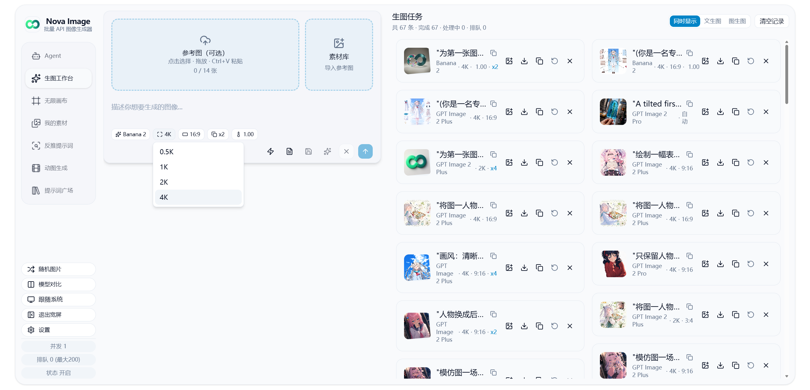 | 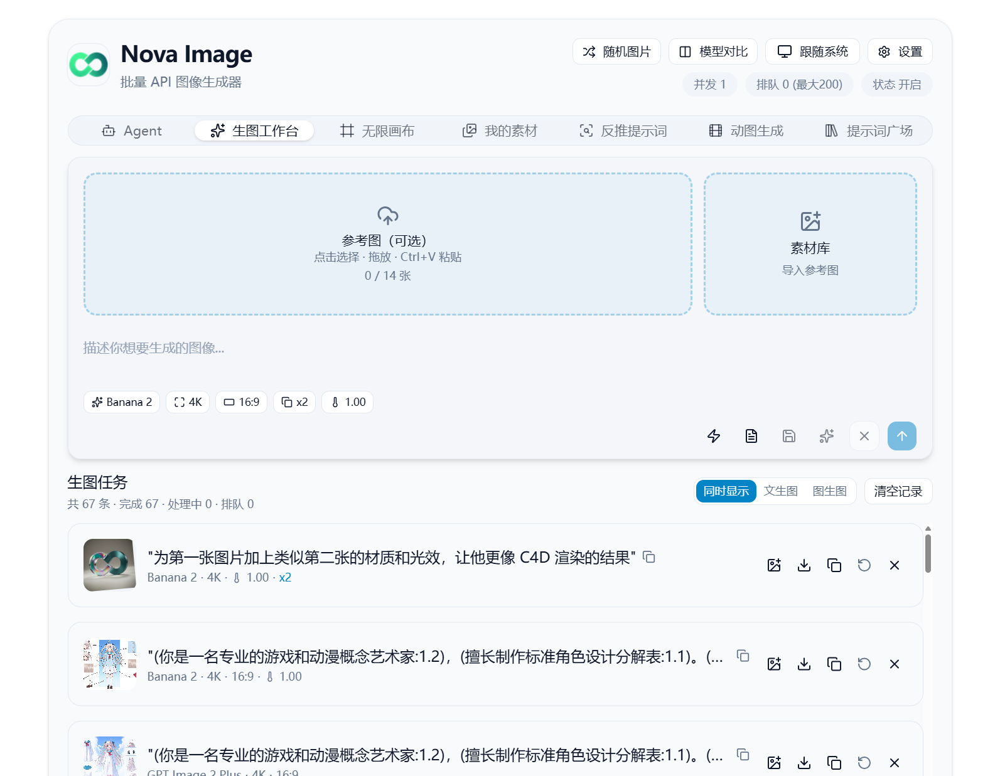 | 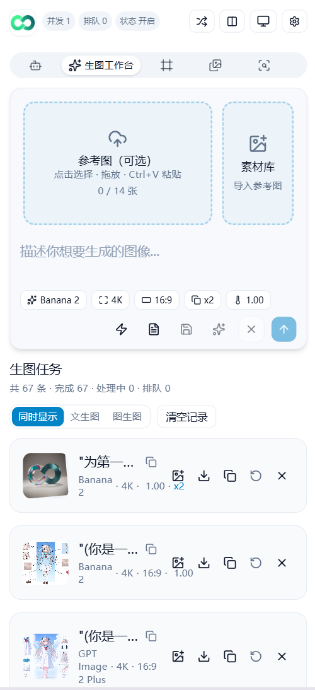 |

### Agent 模式

| 询问 | 生成 |
|:---:|:---:|
| 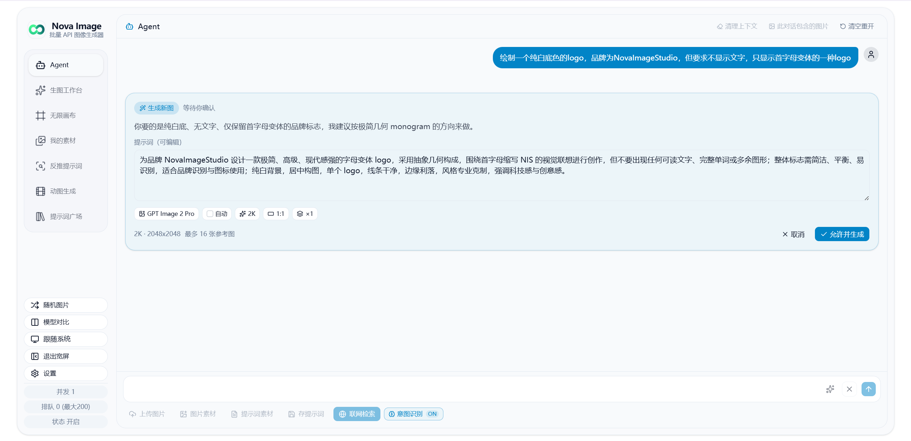 | 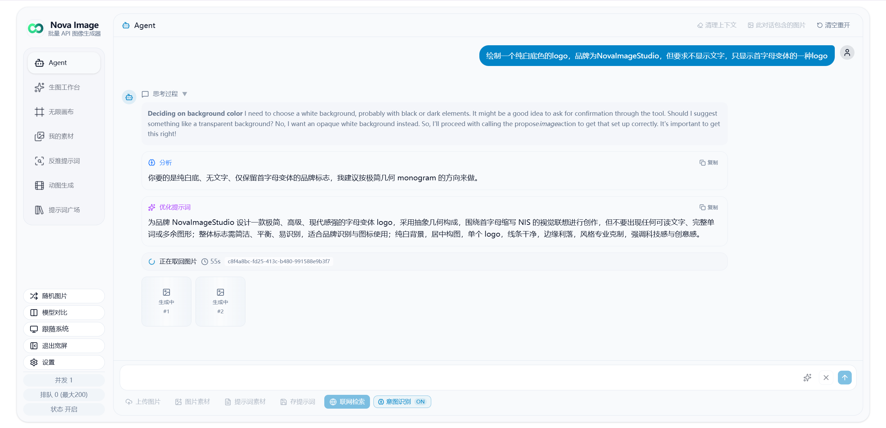 |

### GIF 生成

| 生成 | 微调 |
|:---:|:---:|
| 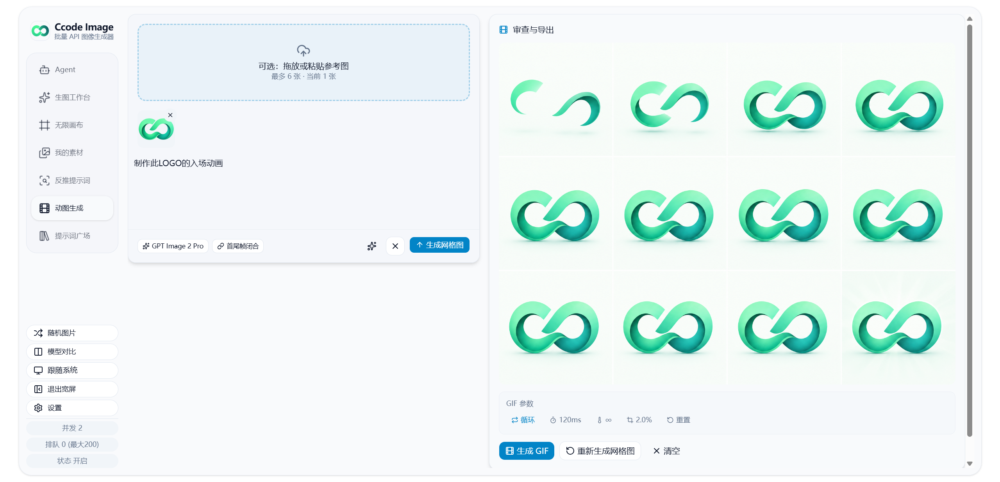 | 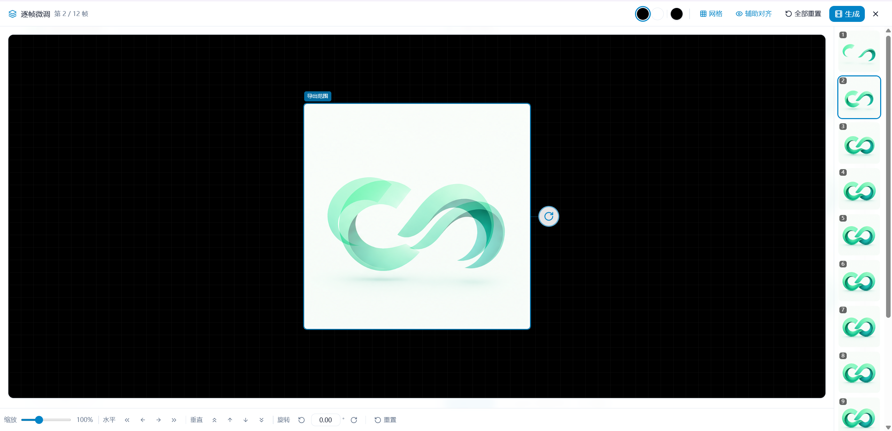 |

### 无限画布

| 预览 | 编辑 |
|:---:|:---:|
| 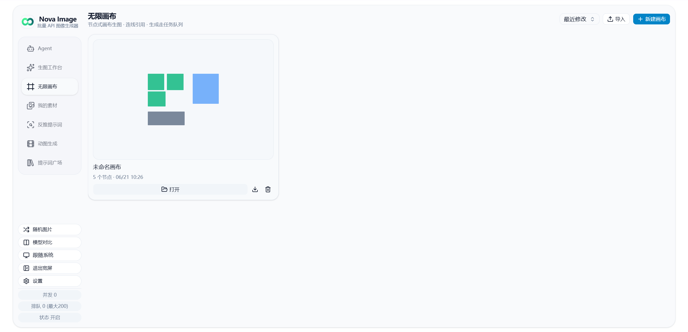 | 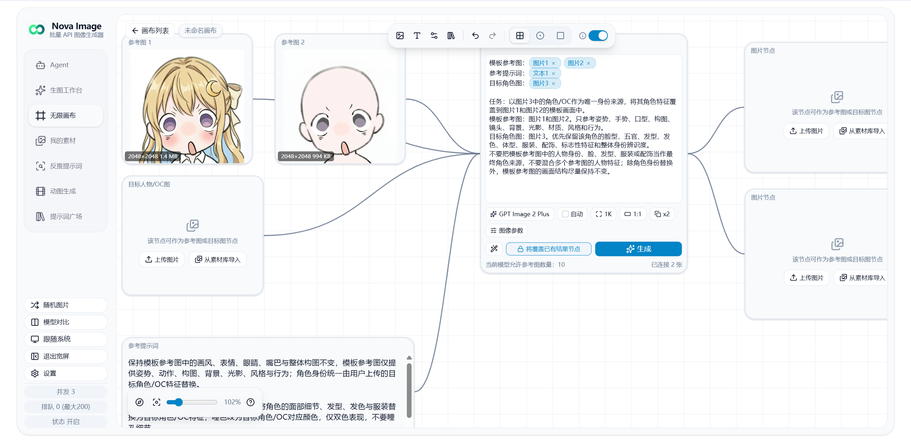 |

### 其他功能

| 反推提示词 | 提示词广场 | 我的素材 | 设置 |
|:---:|:---:|:---:|:---:|
| 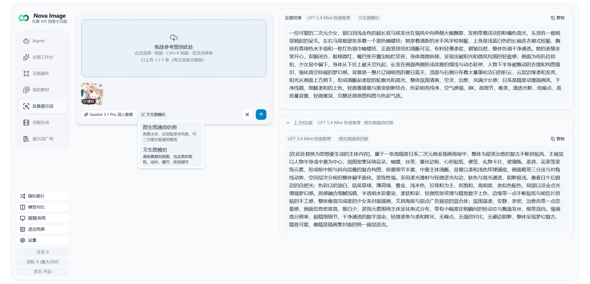 |  | 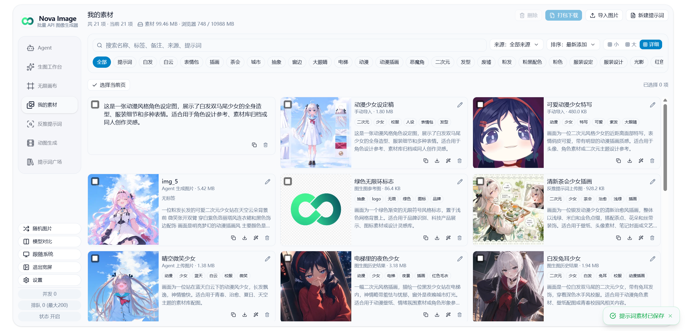 | 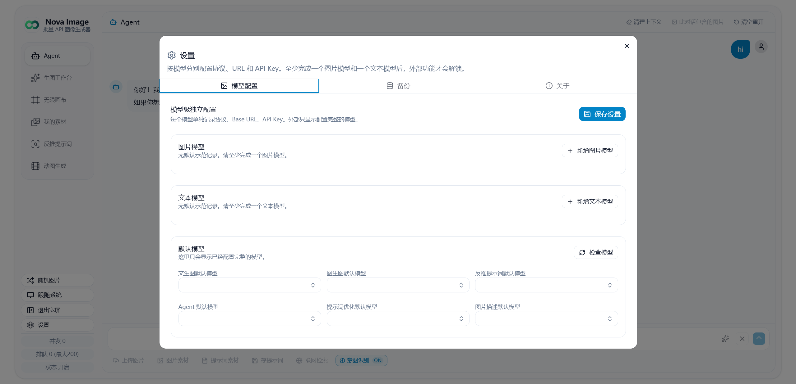 |

---

## ✨ 功能特性

### 五大工作模式

| 模式 | 入口 | 简介 |
| --- | --- | --- |
| 🎨 文本生图 | `TextToImageForm` | 纯文字提示词生成图像，支持多图并行 |
| 🖼️ 图生图 | `ImageToImageForm` | 上传参考图，编辑/转换/风格化 |
| 🤖 Agent 智能体 | `AgentChatWorkspace` | 多轮对话式生成：聊天 → 方案 → 出图，支持 vision 描述、联网搜索、reasoning |
| 🔍 反推提示词 | `ReversePromptForm` | 上传图片流式反推提示词（支持所有已配置的文字模型） |
| 🎬 动图生成 | `GifGenerationWorkspace` | 多帧生图 + 网格拼合，浏览器端编码 GIF（`gifenc`） |

### 提示词广场

`PROMPT_GALLERY_MODE` 三种工作方式：

- `1` 常驻：Tab 始终显示
- `2` 私密：需要密码验证（密码来自后端环境变量 `PROMPT_GALLERY_PASSWORD`）
- `3` 关闭：完全不显示

提示词内容由后端 `backend/prompts.json` 维护，支持敏感词过滤（`backend/blacklist.json`）。

### 模型系统

Nova Image 采用**用户自定义模型**架构：

- **模型级配置**：每个图片模型和文本模型都独立保存协议、显示名称、模型 ID、API Key 与 Base URL
- **图像模型**：用户自由添加、编辑、删除，支持设置协议、显示名称、模型 ID、最大参考图数量、最大分辨率
- **Image 2 额外参数**：仅 OpenAI 图片模型显示，透明背景、质量、风格控件默认开启，用户可手动关闭
- **文字模型**：支持自定义扩展，兼容 Gemini 和 OpenAI Response
- **默认模型**：可为文本生图、图生图、反推提示词、Agent 等任务分别设置默认模型

### 任务系统

- 提交后入队，服务端并发处理（默认上限 50，可通过 `NOVA_TASK_CONCURRENCY` 调整）
- 浏览器通过 **WebSocket** 实时接收任务/队列状态，断线自动重连，失败 5 次后回退 **HTTP 轮询**（30 秒间隔）
- 任务结果本地落盘（`backend/nova-images/`），HTTP 路由 `/api/nova/images/:taskId/:index` 直接提供
- 任务 TTL 12 小时，过期自动清理（5 分钟一次）
- 服务重启时把残留"处理中"任务标记为失败并删除产物，避免幽灵任务

### 体验与工程化

- PWA（`next-pwa`），可安装到桌面
- 三端兼容 UI：桌面端、平板端、移动端自适应布局，提供一致的用户体验
- 暗色 / 亮色主题切换
- 宽屏 / 窄屏自适应布局（左侧垂直 Tab + 右侧内容）
- 历史任务持久化（IndexedDB / localStorage）
- 一键备份 / 恢复（`JSZip` 打包 localStorage + IndexedDB，支持跳过不兼容旧配置并恢复其余数据）
- 历史图片懒加载（`@tanstack/react-virtual`）
- 随机图、Toast 通知、确认对话框

---

## 📁 项目结构

```text
nova-image-studio/
├── frontend/                 # Next.js 前端（React 19 + TS）
│   ├── src/
│   │   ├── app/              # 根页面 layout.tsx / page.tsx
│   │   ├── components/       # 业务组件 + shadcn/ui 基础组件
│   │   │   ├── workspace/    # 主工作台壳、Tab、Header、结果区
│   │   │   ├── agent/        # Agent 模式相关组件
│   │   │   └── ui/           # shadcn 风格 UI 基础件
│   │   ├── hooks/            # useQueueStatus / useAgentChat / useGifWorkflow / ...
│   │   ├── lib/              # 客户端工具、API 客户端、WebSocket、备份
│   │   └── test/             # vitest 配置与用例
│   ├── public/               # PWA 图标、静态资源
│   ├── next.config.ts        # 静态导出 + next-pwa 配置
│   ├── package.json
│   └── vitest.config.ts
├── backend/
│   ├── server.js             # Node 服务（HTTP + WS + SQLite + 任务队列）
│   ├── prompts.json          # 提示词广场内容
│   ├── blacklist.json        # 敏感词
│   ├── .env.example
│   └── package.json
├── scripts/
│   ├── pack.js               # 打包：build + 汇总到 out.zip
│   └── generate-icons.js     # 生成 PWA 图标
├── package.json              # npm workspaces 根
├── LICENSE                   # AGPL-3.0 许可证
└── README.md
```

> 生产构建会输出到 `frontend/out/`，由后端 `server.js` 静态托管。

---

## 🚀 部署指南

<details>
<summary><strong>🐳 Docker Compose 部署</strong></summary>

### 前置要求

- Docker 20.10+
- Docker Compose v2

### 快速启动

```bash
# 1. 复制环境变量文件（如果不是从clone下来的，则自己新建并复制过来即可）
cp backend/.env.example backend/.env

# 2. 编辑 .env 按需调整配置

# 3. 创建必要的配置文件（如果不存在）
touch blacklist.json prompts.json

# 4. 创建数据目录
mkdir -p data/images

# 5. 启动服务
docker compose up -d
```

访问 <http://localhost:3000>。

### 环境变量

通过 `backend/.env` 注入，无需修改镜像。修改后重启生效：

```bash
docker compose restart
```

### 数据持久化

以下目录自动挂载到 `./data/`：

- `nova-images/` - 生成的图片
- `nova-tasks.sqlite` - 任务数据库

</details>

<details>
<summary><strong>📦 本地部署（生产环境）</strong></summary>

### 环境要求

- **Node.js**：20 或 22
- **npm**：自带 workspaces 支持
- `better-sqlite3` 是原生依赖，**生产服务器必须本地 `npm ci --omit=dev`**，不要直接复制本机 `node_modules`

### 部署步骤

#### 1. 在构建机

```bash
npm ci
npm run build
```

产物 `frontend/out/` 已生成。

#### 2. 上传以下到生产服务器

```text
frontend/out/
backend/server.js
backend/package.json
backend/package-lock.json
backend/prompts.json
backend/blacklist.json
backend/.env          # 按生产环境调整
```

#### 3. 在生产服务器

```bash
npm ci --omit=dev        # 必须本地装 better-sqlite3 原生模块
npm start                # 或 npm run server
```

`.env` 中 `NODE_ENV=production`。

#### 4. 进程托管

推荐 **PM2 / systemd / 平台自带进程管理**，确保：

- 进程对 `NOVA_TASK_DB` 指向的 SQLite 文件有读写权限
- 反向代理（Nginx / Caddy / 云网关）将域名转到 `http://127.0.0.1:3000`

#### 5. 一键打包

```bash
npm run go
```

生成根目录 `out.zip`，解压后即可按上面 1~3 步骤部署。

</details>

<details>
<summary><strong>💻 本地开发</strong></summary>

### 环境要求

- **Node.js**：20 或 22
- **npm**：自带 workspaces 支持

### 安装与运行

```bash
# 1. 克隆仓库
git clone https://github.com/tianjiangqiji/nova-image-studio.git
cd nova-image-studio

# 2. 安装依赖（自动安装根、frontend、backend）
npm install

# 3. 复制后端环境变量
cp backend/.env.example backend/.env
# Windows: Copy-Item backend/.env.example backend/.env

# 4. 启动开发模式（等同于 build 后用 production 模式跑 server.js）
npm run dev
```

访问 <http://localhost:3000>。

> 首次启动时需要在 UI 的"设置"中至少完成一个图片模型和一个文本模型配置，并设置默认模型。所有前端配置均保存在浏览器 localStorage，可通过备份功能导出。

### 常用开发脚本

```bash
npm run dev:frontend   # 仅启动 Next.js dev server（HMR，不走静态导出）
npm run dev:backend    # 仅启动后端 server.js
npm run build          # 构建前端静态产物到 frontend/out/
npm start              # 直接跑后端 server.js
npm run lint           # 前端 ESLint
npm test               # 前端 Vitest watch
npm run test:run       # 前端 Vitest 单次
npm run go             # 打包：build + 汇总到根 out.zip
```

</details>

<details>
<summary><strong>🔨 Docker 镜像构建</strong></summary>

### 构建镜像

```bash
docker build -t nova-image-studio:latest .
```

### 推送到仓库

```bash
docker tag nova-image-studio:latest tianjiangqiji/nova-image-studio:latest

docker push tianjiangqiji/nova-image-studio:latest
```

</details>

---

## ⚙️ 环境变量（`backend/.env`）

| 变量 | 必填 | 默认 | 说明 |
| --- | --- | --- | --- |
| `PORT` | 否 | `3000` | 监听端口 |
| `HOSTNAME` | 否 | `0.0.0.0` | 绑定地址，`localhost`/`127.0.0.1` 仅本机 |
| `NODE_ENV` | **是** | `production` | **必须为 `production`**，否则会走 Next dev 模式 |
| `NOVA_TASK_DB` | 否 | `./nova-tasks.sqlite` | SQLite 文件路径，建议放到持久化目录 |
| `NOVA_TASK_CONCURRENCY` | 否 | `50` | 最大并发任务数（绝对上限 50） |
| `NOVA_MAX_QUEUE_SIZE` | 否 | `200` | 全局最大待处理任务数 |
| `NOVA_RATE_LIMIT_WINDOW_MS` | 否 | `60000` | 创建任务速率限制窗口，单位毫秒 |
| `NOVA_RATE_LIMIT_MAX_REQUESTS_PER_IP` | 否 | `20` | 单 IP 在一个窗口内最多创建多少个任务 |
| `NOVA_RATE_LIMIT_MAX_REQUESTS_PER_API_KEY` | 否 | `20` | 单 API Key 在一个窗口内最多创建多少个任务 |
| `NOVA_MAX_PENDING_TASKS_PER_IP` | 否 | `20` | 单 IP 最多同时拥有多少个待处理任务 |
| `NOVA_MAX_PENDING_TASKS_PER_API_KEY` | 否 | `10` | 单 API Key 最多同时拥有多少个待处理任务 |
| `NOVA_RATE_LIMIT_RETRY_AFTER_SECONDS` | 否 | `30` | 队列满/限流时响应头 `Retry-After` 秒数 |
| `NOVA_IMAGE_DIR` | 否 | `backend/nova-images/` | 任务产物落盘目录 |
| `PROMPT_GALLERY_MODE` | 否 | `2` | `1` 常驻 / `2` 私密密码（点七下标题） / `3` 关闭 |
| `PROMPT_GALLERY_PASSWORD` | 否 | 空 | 提示词广场私密模式密码；为空时私密模式可直接开启 |

> `.env` 修改后大部分运行时配置**实时生效**（任务并发、限流、队列容量、接单开关、广场模式），无需重启；`PORT`、`HOSTNAME`、`NODE_ENV` 这类启动级配置仍需重启。

---

## 📡 API 速览

后端暴露在 `/api/nova/*` 路径下，前端在同源调用。

| 方法 | 路径 | 说明 |
| --- | --- | --- |
| `POST` | `/api/nova/tasks` | 创建任务，返回 `{ taskId }`（202） |
| `GET` | `/api/nova/tasks/:id` | 查询任务状态与结果 |
| `POST` | `/api/nova/tasks/:id/ack` | 续期：把 TTL 延长 2 分钟 |
| `GET` | `/api/nova/queue-status` | 当前并发 / 排队 / 接收状态 |
| `GET` | `/api/nova/prompts` | 提示词广场内容 |
| `GET` | `/api/nova/blacklist` | 敏感词列表 |
| `GET` | `/api/nova/config` | 前端配置（如 `promptGalleryMode`） |
| `GET` | `/api/nova/images/:taskId/:index` | 任务产物图片 |
| `WS` | `/api/nova/ws` | 实时任务 / 队列订阅 |

### 任务状态

- `排队中`：等待调度
- `processing`：正在调用上游 API
- `completed`：成功，`result.images` 包含产物链接
- `failed`：失败，详见 `error`
- `expired`：超过 TTL

---

## ❓ 常见问题

**为什么生产环境不用 `next start`？**
项目使用 `output: 'export'`，构建产物是纯静态 `out/`。`server.js` 同时托管静态文件 + 任务 API，不再依赖 `next start`。

**只部署 `out/` 能用吗？**
UI 可以打开，但任务提交、Agent、历史同步全部依赖 `/api/nova/*`，必须运行 `server.js`。

**数据库需要单独备份吗？**
首次部署不需要，服务启动会自建。任务数据要保留就备份 `nova-tasks.sqlite`（含 WAL/SHM）以及 `nova-images/`。重启后残留任务会被自动标记为失败并清理产物。

**如何临时停止接收新任务（不停服务）？**
编辑 `.env`：

```env
NOVA_ACCEPT_NEW_TASKS=false
```

保存即生效。等待在飞任务完成后即可重启升级。再次开启设为 `true` 或留空。

**任务多久会过期？**
创建后 12 小时；前端在拿到结果后会调用 `/ack` 续期 2 分钟，给下载留时间。超过 TTL 服务端删除数据库记录与产物图片。

---

## 🙏 致谢

本项目的无限画布工作区功能基于 [infinite-canvas](https://github.com/basketikun/infinite-canvas) 项目开发，感谢原作者 [basketikun](https://github.com/basketikun) 的开源贡献。

感谢 [Linux.do](https://linux.do/) 社区的支持。

---

## ☕ 赞助支持
<div align="center">

如果这个项目对你有帮助，欢迎通过爱发电赞助支持，你的每一份鼓励都是持续更新的动力！

<br>
<br>

<a href="https://www.ifdian.net/a/skyjee">
  
</a>

<br>
<br>

</div>
---

## 📬 联系方式

邮箱：skyjee@linux.do

---
## Star History


<a href="https://www.star-history.com/?repos=tianjiangqiji%2Fnova-image-studio&type=date&legend=top-left">
 <picture>
   <source media="(prefers-color-scheme: dark)" srcset="https://api.star-history.com/chart?repos=tianjiangqiji/nova-image-studio&type=date&theme=dark&legend=top-left" />
   <source media="(prefers-color-scheme: light)" srcset="https://api.star-history.com/chart?repos=tianjiangqiji/nova-image-studio&type=date&legend=top-left" />
   
 </picture>
</a>

---

## 📄 许可证

本项目采用 [GNU Affero General Public License v3.0](LICENSE)（AGPL-3.0）开源许可证。

这意味着：

- ✅ 你可以自由使用、修改和分发本软件
- ✅ 你可以将本软件用于商业用途
- ⚠️ 如果你修改了本软件并通过网络提供服务，你必须公开修改后的源代码
- ⚠️ 基于本软件的衍生作品必须使用相同的 AGPL-3.0 许可证

详细条款请参阅 [LICENSE](LICENSE) 文件。

---

<div align="center">

**[⬆ 回到顶部](#nova-image-studio)**

</div>
